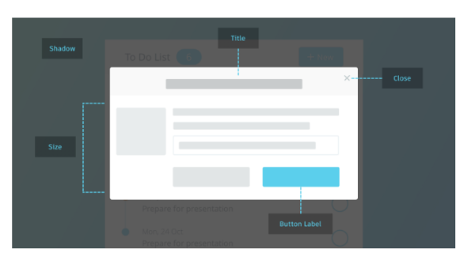

# Modal

## Descripción
Una ventana modal es un elemento que se encuentra o aparece encima de la ventana principal de una aplicación o sistema. Los usuarios deben interactuar con la ventana modal antes de que puedan volver a la aplicación principal.

```html
<div class="modal">
    <div class="modal-ventana">
        <button class="modal-cerrar">X</button>
        <h1>Esto es un título</h1>
        <p>Espacio para textos. Lemon drops pudding bonbon biscuit lollipop chupa chups I love jelly beans I love. Cheesecake marshmallow gummies biscuit oat cake marshmallow lemon drops. Lollipop dragée cake I love soufflé I love gummies jelly.
        </p>
        <p>Cotton candy dragée chocolate bar carrot cake. Fruitcake marshmallow topping bear claw jelly beans macaroon. Chocolate donut chocolate.
        </p>
        <button>Aceptar</button>
        <button>Cancelar</button>
    </div>
</div>
```

```css
.modal{
    position:fixed;
    background-color:rgba(0,0,0,0.5);
    top:0;
    left:0;
    right:0;
    bottom:0;
    z-index:1000;
}
.modal .modal-ventana{
    position:relative;
    width:600px;
    background-color:#ffffff;
    margin:0 auto;
    padding:20px;
    top:10%;
}
.modal .modal-cerrar{
    position:absolute;
    top:0;
    right:0;
}
```

[//]: # (incluir opción para abrir/cerrar modal)

## ¿Cuándo se usa?
Pueden existir principalmente 3 escenarios de uso:
* Llamar la atención del usuario para notificar o comunicar diálogos importantes.
* Centrar la atención del usuario en una tarea específica.
* Mostrar información adicional sin sacar al usuario del flujo de navegación.

## ¿Cómo se usa?
* El usuario siempre debe contar con acciones que le permitan cerrar la ventana modal y regresar a la pantalla principal.
* La ventana modal debe contar con un título y descripción corta que ayude a soportar la interacción con el usuario.
* La ventana modal debe permitir al usuario tener contexto, por lo tanto no debe ocupar todo el tamaño de la pantalla, permitiendo visibilidad de la pantalla principal.


## Referencias
* <https://www.usability.gov/what-and-why/glossary/hover-help-or-tool-tiptooltip.html>
* <https://uxplanet.org/tooltips-in-ui-design-f63e117aa3d1>

